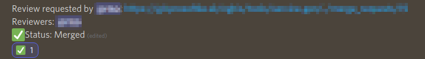

# Mergebot

Discord bot for gitlab merge requests.  
Checks messages sent into merge request channel assigns reviewers and performs merge requests. Reviewers are picked from online pool of users with the same role as the name of a category in which merge requests channel is. 

For example if you have a category named `team1` with a channel `merge-requests` you should have a role `team1` with users that should be picked for reviews in that channel.

### Environment variables

**DISCORD_TOKEN** - token for your discord bot  
**GITLAB_TOKEN** - gitlab token to perform merge actions  
**GITLAB_HOST** - gitlab host (ex.: gitlab.local)  
**APPROVE_COUNT** - approvals needed to perform merge action  
**REVIEWER_COUNT** - number of reviewers picked from online pool of users. Users are picked from a role that matches merge channel category  
**MERGE_REQUEST_CHANNEL** - channel name where bot should scan messages for merge requests (ex.: merge-requests)  
**CATEGORIES** - comma separated list of categories. Categories are used to pair merge requests to role. For example if you have category name backend you should also have a role named backend. Users for review will be picked from this role.  

### Docker

Build docker image 
```bash
docker build -t mergebot:latest .
```

Run image 
```bash
docker run --name mergebot --rm \
    --env DISCORD_TOKEN=<BOT_TOKEN> \
		--env GITLAB_TOKEN=<GITLAB_TOKEN> \
		--env GITLAB_HOST=gitlab.local \
		--env APPROVE_COUNT=2 \
		--env REVIEWER_COUNT=3 \
		--env MERGE_REQUEST_CHANNEL=merge-requests \
		--env CATEGORIES=team1,team2 \
		mergebot
```


